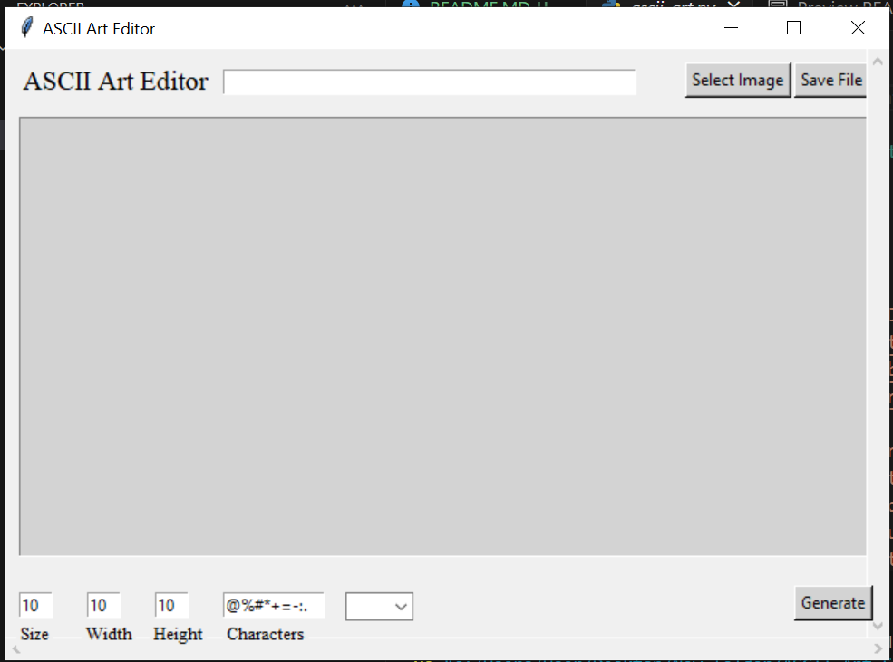
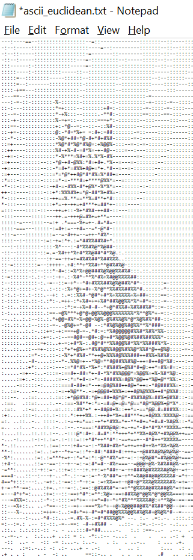

<h1>ASCII Art Editor</h1>
  
This is a Python ASCII art editor that allows users to create and manipulate ASCII art using a graphical user interface (GUI). The editor utilizes the tkinter module for creating the GUI, including windows, buttons, menus, and other interactive elements.

 
 
 
  <h2>Features</h2>
  <ul>
    <li><strong>GUI Development:</strong> The tkinter module is used to create a user-friendly interface for the ASCII art editor. Users can interact with the editor through buttons, menus, and other graphical elements.</li>
    <li><strong>Event Handling:</strong> The editor implements event handling using tkinter to respond to user actions. This includes handling button clicks, menu selections, and other user interactions.</li>
    <li><strong>ASCII Art Manipulation:</strong> The numpy module is integrated into the editor to handle the manipulation and processing of ASCII art data. This includes converting images to ASCII art, applying filters, and adding effects to the art.</li>
    <li><strong>Multi-threading:</strong> The thread module is utilized to implement multi-threading capabilities in the editor. This allows for concurrent execution of tasks, improving the responsiveness of the editor.</li>
  </ul>

  <h2>Installation</h2>
  <ol>
    <li>Clone the repository: 
      <code>git clone https://github.com/your-username/ascii-art-editor.git</code></li>
    <li>Install the required dependencies: 
      <code>pip install tkinter numpy</code></li>
    <li>Run the editor: 
      <code>python editor.py</code></li>
  </ol>

  <h2>Usage</h2>
  
Once the editor is running, you can perform the following actions:

  <ul>
    <li>Create a new ASCII art: Click on the "New" button to start a new ASCII art project.</li>
    <li>Open an existing ASCII art: Click on the "Open" button to load an existing ASCII art file.</li>
    <li>Save the ASCII art: Click on the "Save" button to save the current ASCII art to a file.</li>
    <li>Apply filters and effects: Use the provided menus and buttons to apply various filters and effects to the ASCII art.</li>
    <li>Edit the ASCII art: Use the provided tools and options to edit the ASCII art, such as changing characters, colors, and sizes.</li>
    <li>Undo and redo changes: Use the "Undo" and "Redo" buttons to revert or reapply changes made to the ASCII art.</li>
    <li>Export the ASCII art: Click on the "Export" button to export the ASCII art as an image file.</li>
  </ul>

  <h2>Contributing</h2>
  
Contributions to the ASCII art editor are welcome! If you find any bugs or have suggestions for new features, please open an issue on the GitHub repository.

  <h2>License</h2>
  
This project is licensed under the MIT License. See the <a href="LICENSE">LICENSE</a> file for more information.

